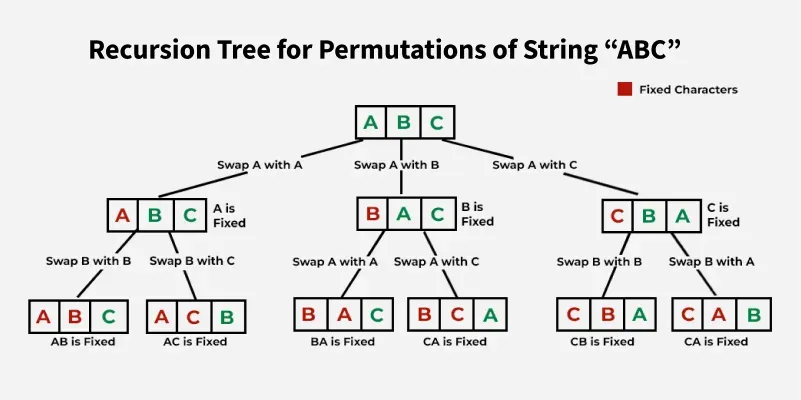
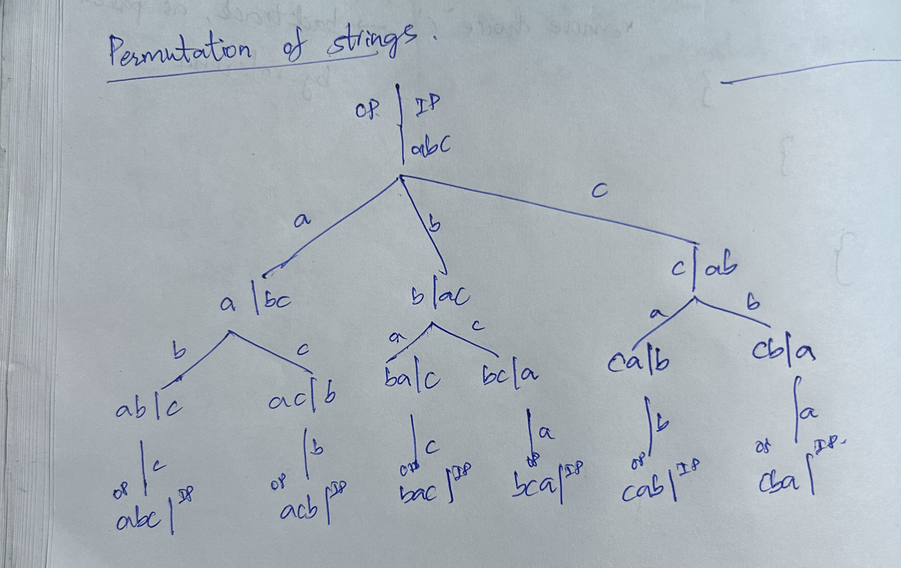
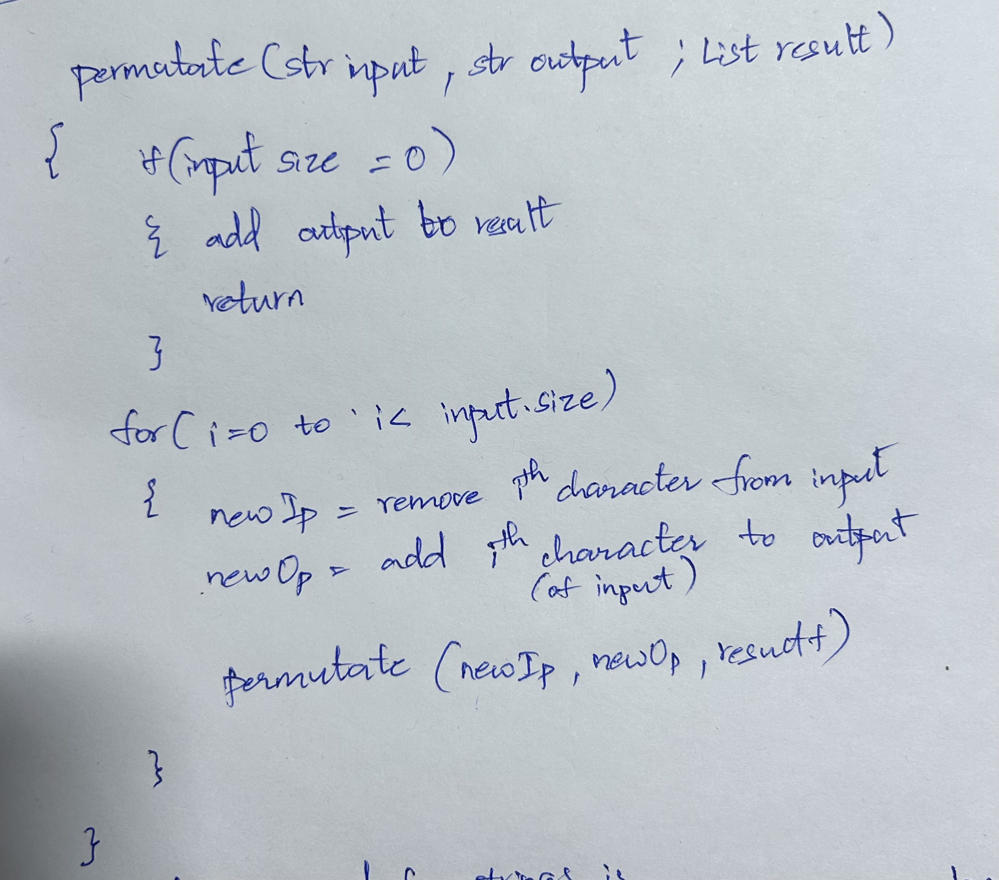

# Problem
- Title: Permutations of a Given String
- Source link: [GeeksforGeeks](https://www.geeksforgeeks.org/problems/permutations-of-a-given-string2041/1)
- Description:
  Given a string `s`, which may contain duplicate characters, generate and return all unique permutations of the string. The answer can be returned in any order.

- Example:
  Input: `s = "ABC"`
  Output: `["ABC", "ACB", "BAC", "BCA", "CAB", "CBA"]`
  Explanation: Given string `ABC` has 6 unique permutations.

- Constraints:
  - `1 <= s.size() <= 9`
  - `s` contains only uppercase English alphabets

---

# Intuition
If we use plain swapping backtracking, duplicate characters create duplicate branches.

**Recursion tree intuition for `"ABC"`**



This tree shows the swap-based idea clearly: at each level, we fix one character at the current index and recurse to permute the remaining suffix.

Example: for `"AAB"`, placing the first `'A'` at index `0` and placing the second `'A'` at index `0` produce the same set of permutations. So, at each recursion level, we should place each distinct character only once.

The clean way to do that in a swap-based solution is:
- fix one position at a time
- use a `HashSet<Character>` for the current recursion level
- skip characters that were already used for the current fixed position

### Another way to look at it!

  

  

- Instead of deleting from input and adding it to output, replace each character of the string with the first index and find permutations for the rest of the string recursively 
---

# Approach
1. Start recursion from index `0`.
2. For the current index `idx`, try every character from `idx` to `n - 1` as the next fixed character.
3. Maintain a `HashSet<Character>` inside the current recursive call.
4. If a character has already been used at this level, skip it to avoid duplicate permutations.
5. Otherwise, swap it into position `idx`, recurse for `idx + 1`, then swap back to restore the string.
6. When `idx` reaches the last position, add the formed permutation to the result.
7. Sort the final result because GFG typically expects lexicographically ordered output.

**Example: `"AAB"`**
```text
idx = 0:
  use 'A' once -> generate "AAB", "ABA"
  skip second 'A' at this level
  use 'B' -> generate "BAA"
```

---

# Complexity

- Time complexity:
  `O(n * n!)`

In the worst case, all characters are distinct, so there are `n!` permutations. Building each output string costs `O(n)`.

- Space complexity:

`O(n! * n) + O(n)`

`O(n! * n)` is used to store all permutations, and `O(n)` is the recursion stack depth. The per-level `HashSet` also contributes up to `O(n)` extra space across the active recursion path.

---

# Code
```java
import java.util.*;

class Solution {
    public List<String> findPermutation(String s) {
        ArrayList<String> res = new ArrayList<>();
        char[] arr = s.toCharArray();

        solve(arr, 0, res);
        Collections.sort(res);

        return res;
    }

    void solve(char[] arr, int idx, ArrayList<String> res) {
        if (idx == arr.length - 1) {
            res.add(new String(arr));
            return;
        }

        HashSet<Character> used = new HashSet<>();

        for (int i = idx; i < arr.length; i++) {
            if (used.contains(arr[i])) {
                continue;
            }

            used.add(arr[i]);
            swap(arr, i, idx);
            solve(arr, idx + 1, res);
            swap(arr, i, idx);
        }
    }

    void swap(char[] arr, int i, int j) {
        char temp = arr[i];
        arr[i] = arr[j];
        arr[j] = temp;
    }
}
```

---

# One-line takeaway
Use swap-based backtracking, but at each recursion level allow each distinct character to be fixed only once to avoid duplicate permutations.

---

# Variant: When There Are No Duplicates
If the string contains all distinct characters, we do not need a `HashSet` at each recursion level because every swap creates a new valid branch.

## Intuition
Fix one position at a time.

For index `idx`, swap every character from `idx` to `n - 1` into that position, recurse for the remaining suffix, and then swap back. Since all characters are unique, no duplicate permutation can be generated.

## Approach
1. Convert the string to a character array.
2. Start recursion from index `0`.
3. For each index `idx`, try all positions from `idx` to `n - 1`.
4. Swap the current character into position `idx`.
5. Recurse for `idx + 1`.
6. Swap back to restore the original state.
7. When `idx == n - 1`, add the current arrangement to the result.

## Complexity
- Time complexity:
  `O(n * n!)`

There are `n!` permutations, and creating each string takes `O(n)`.

- Space complexity:
  `O(n! * n) + O(n)`

`O(n! * n)` is for storing all permutations, and `O(n)` is the recursion stack depth.

## Code
```java
import java.util.*;

class Solution {
    public List<String> findPermutation(String s) {
        ArrayList<String> res = new ArrayList<>();
        char[] arr = s.toCharArray();

        solve(arr, 0, res);
        return res;
    }

    void solve(char[] arr, int idx, ArrayList<String> res) {
        if (idx == arr.length - 1) {
            res.add(new String(arr));
            return;
        }

        for (int i = idx; i < arr.length; i++) {
            swap(arr, i, idx);
            solve(arr, idx + 1, res);
            swap(arr, i, idx);
        }
    }

    void swap(char[] arr, int i, int j) {
        char temp = arr[i];
        arr[i] = arr[j];
        arr[j] = temp;
    }
}
```
## Variant - Permutation of integer array - no duplicates
 - Source link: [Interviewbit](https://www.interviewbit.com/problems/permutations/)
```java
public class Solution 
{
    public ArrayList<ArrayList<Integer>> permute(ArrayList<Integer> A) 
    {
        int n = A.size();
        ArrayList<ArrayList<Integer>> res = new ArrayList<ArrayList<Integer>>();
        permutate(A, 0, n - 1, res);
        return res;
    }
    void permutate(ArrayList<Integer> A, int idx, int n, ArrayList<ArrayList<Integer>> res)
    {
        if(idx == n)
        {
            res.add(new ArrayList(A));
            return;
        }
        
        for(int i = idx; i <= n; i++)
        {
            Collections.swap(A, i, idx);
            
            permutate(A, idx + 1, n, res);
            
            Collections.swap(A, i, idx);
        }
    }
}

```