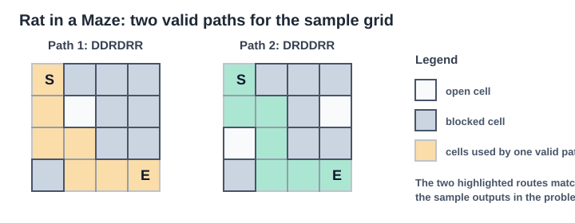
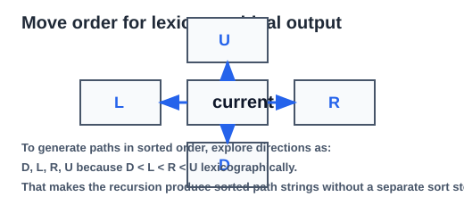

# Problem
- Title: Rat in a Maze
- Source link: [GeeksforGeeks](https://www.geeksforgeeks.org/problems/rat-in-a-maze-problem/1)
- Description:
  A rat starts at cell `(0, 0)` in an `n x n` matrix and wants to reach cell `(n - 1, n - 1)`.  
  A cell with value `1` is open and can be used. A cell with value `0` is blocked.  
  The rat can move in four directions: `U`, `D`, `L`, `R`, but it cannot revisit a cell in the same path.  
  Return all valid paths in lexicographically sorted order.

- Example:
  Input: `maze = [[1, 0, 0, 0], [1, 1, 0, 1], [1, 1, 0, 0], [0, 1, 1, 1]]`
  Output: `["DDRDRR", "DRDDRR"]`
  Explanation: There are two valid ways to reach the destination, and they are returned in sorted order.

- Constraints:
  - `2 <= n <= 5`
  - `0 <= maze[i][j] <= 1`

---

# Intuition
This is a path-generation problem, not a shortest-path problem.

We are not trying to find just one route from source to destination. We must generate **all possible valid routes**. That usually points toward backtracking:
- try one move
- continue exploring from there
- when done, undo that choice and try the next move



## Why plain DFS alone is not enough
If we simply do DFS without tracking visited cells, the rat can move in cycles.

Example:
```text
(0,0) -> (1,0) -> (0,0) -> (1,0) -> ...
```

That creates infinite revisits.

So for the current path, we must remember which cells are already used. That is why we maintain a `visited[][]` matrix.

## Core idea
At any cell `(r, c)`:
- if it is the destination, the current path is complete
- otherwise, try all four directions
- only move if:
  - the new cell is inside the grid
  - the new cell is open (`1`)
  - the new cell has not been visited in the current path

This guarantees that every recursive branch always represents a valid partial path.

## Why backtracking works here
Suppose we are at `(1, 0)` and choose to go right to `(1, 1)`.

That move affects the current path in two ways:
- we append a direction character, say `'R'`
- we mark `(1, 1)` as visited

After recursively exploring all paths from `(1, 1)`, we must restore the state before trying the next move:
- remove `'R'` from the path
- unmark `(1, 1)` as visited

That undo step is exactly what backtracking means.

## Why the start cell is marked visited first
The rat starts at `(0, 0)`, so that cell already belongs to the current path.

If we do not mark it as visited before exploration, then a neighboring cell can move back into `(0, 0)`, which incorrectly revisits the start and may create cycles.

So before the first recursive call:
```java
visited[0][0] = true;
```

This correctly says: the current path already contains the start cell.

## Why the direction order is `D, L, R, U`
The problem asks for the final list in lexicographically sorted order.

The path strings are made from characters:
```text
'D', 'L', 'R', 'U'
```

Lexicographically:
```text
D < L < R < U
```

So if the recursion explores moves in this exact order:
- first all paths starting with `D`
- then all paths starting with `L`
- then all paths starting with `R`
- then all paths starting with `U`

then the generated paths are already sorted. No extra sorting step is needed afterward.



## Small example
For:
```text
1 1 1
1 0 1
1 1 1
```

From `(0,0)`:
- going `D` eventually gives `DDRR`
- going `R` eventually gives `RRDD`

Since `D` is explored before `R`, the answer naturally becomes:
```text
["DDRR", "RRDD"]
```

which is already lexicographically correct.

## Recursion tree intuition
Think of every recursive call as:
- current position
- current path string so far

From one cell, up to four branches can be created:
```text
current cell
|- D
|- L
|- R
`- U
```

Most of these branches are rejected immediately because:
- the move goes out of bounds
- the cell is blocked
- the cell is already visited

So the recursion only continues along valid path prefixes.

---

# Approach
1. Create a result list `paths`.
2. If the start cell `(0,0)` is blocked, return the empty list immediately.
3. Create a `visited` matrix of the same size as the maze.
4. Mark `visited[0][0] = true` because the rat starts there.
5. Start backtracking from `(0,0)` with an empty `StringBuilder`.
6. In each recursive call:
   - if the current cell is the destination, add the built path string to the answer
   - otherwise, try the four directions in order `D, L, R, U`
7. For every valid next cell:
   - append the direction character
   - mark the next cell visited
   - recurse
   - remove the last direction character
   - unmark the next cell visited
8. Return the collected paths.

---

# Complexity

- Time complexity:
  Exponential in the worst case, approximately `O(4^(n*n))`

In the worst case, many recursive branches may be explored because from each cell we can try up to four directions. Since the grid size is very small (`n <= 5`), this backtracking solution is feasible.

- Space complexity:

`O(n*n)`

`visited[][]` takes `O(n*n)` space, and the recursion stack plus current path can also grow up to `O(n*n)` in the worst case.

---

# Code
```java
class Solution 
{
    public ArrayList<String> ratInMaze(int[][] maze) 
    {
        int rows = maze.length;
        int cols = maze[0].length;

        boolean[][] visited = new boolean[rows][cols];
        ArrayList<String> paths = new ArrayList<>();
        
        if(maze[0][0] == 0) return paths;
        
        visited[0][0] = true;

        findPaths(maze, visited, 0, 0, new StringBuilder(), paths);

        return paths;
    }

    void findPaths(int[][] maze, boolean[][] visited, int r, int c, StringBuilder curPath, ArrayList<String> paths)
    {
        if(r == maze.length - 1 && c == maze[0].length - 1)
        {
            paths.add(curPath.toString());
            return;
        }

        int[] dr = new int[]{1, 0, 0, -1};
        int[] dc = new int[]{0, -1, 1, 0};
        char[] dir = new char[]{'D', 'L', 'R', 'U'};

        for(int i = 0; i < 4; i++)
        {
            int newR = r + dr[i];
            int newC = c + dc[i];

            if(isValid(maze, newR, newC) && !visited[newR][newC])
            {
                int len = curPath.length();
                curPath.append(dir[i]);
                visited[newR][newC] = true;
                
                findPaths(maze, visited, newR, newC, curPath, paths);
                
                curPath.setLength(len);
                visited[newR][newC] = false;
            }
        }
    }

    boolean isValid(int[][] maze, int r, int c)
    {
        return r >= 0 && c >= 0 && r < maze.length && c < maze[0].length && maze[r][c] == 1;
    }
}
```

---

# One-line takeaway
Use backtracking with a `visited` matrix to explore every valid path, and try directions in `D, L, R, U` order so the generated answers are already lexicographically sorted.
